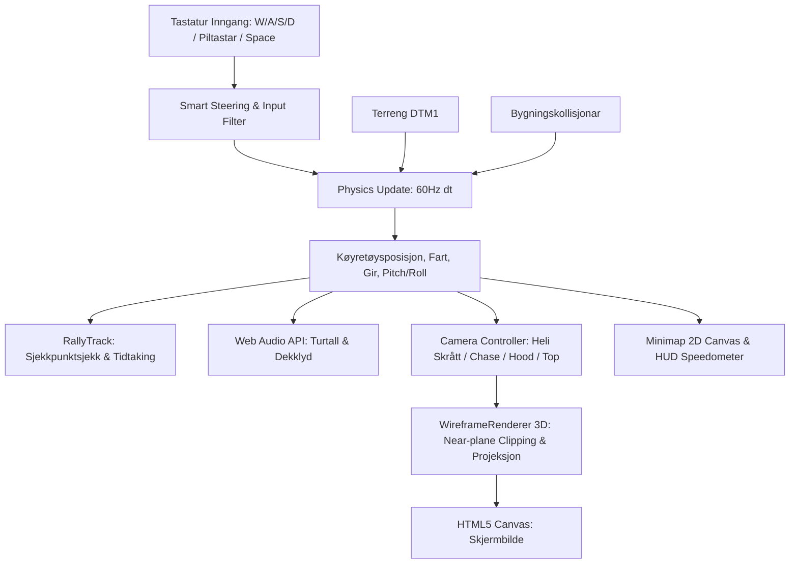

# Systemarkitektur — Årølia Rally 3D

## 1. Oversikt og Designfilosofi
Årølia Rally 3D er eit nettlesarbasert 3D rallyspel i retro wireframe- / linjegrafikkstil ("stick-man-stil") som køyrer på ekte kart- og høgdedata frå **Årølia i Molde** (Møre og Romsdal, Noreg).

### Kjernefilosofi:
- **Null eksterne køyretidsavhengnader (Zero runtime dependencies):**
  Spelet krev verken Three.js, Babylon.js, WebGL eller tunge rammeverk. All 3D-matematikk (vektorar, 4x4 matriser, kameraprojeksjon, linjeklipping) og teikning er skrive frå botnen i rein standard Vanilla JavaScript og HTML5 Canvas 2D Context.
- **Rett fram i alle nettlesarar:**
  Kan køyrast direkte ved å opne `index.html` eller via ein enkel statisk HTTP-server (`python -m http.server 8080`).
- **Autonom to-spora arkitektur (Web + Headless verifikasjon):**
  Kvar komponent i spelet har ein motpart som kan testast og validerast utan nettlesar via Node.js og Python-testsuiten.

---

## 2. Fil- og Mappestruktur

```
ÅrøliaRally/
├── index.html                      # Hovud-HTML, HUD, Canvas og spelkontrollar
├── AGENTS.md                       # Hovudinstruksjon og protokoll for AI-agentar
│
├── css/
│   └── style.css                   # Cyberpunk / retro wireframe styling og HUD-layout
│
├── js/
│   ├── data/
│   │   └── bundle.js               # Samansmelta datafil (vegar, bygningar, terreng, track, projeksjon)
│   ├── engine/
│   │   ├── math3d.js               # Vektorar (Vector3), 4x4 matriser (Matrix4), frustum clipping
│   │   ├── terrain.js              # Bilineær terrenghøgdesampling og normalvektorar
│   │   ├── physics.js              # Køyretøysfysikk, hjuloppheng, gir, smart styring, kollisjonar
│   │   ├── wireframeRenderer.js    # 3D programvarerasteriser, linjeklipping, veg-ribbons
│   │   └── audio.js                # Web Audio API syntetiserte motorlydar og dekklydar
│   └── game/
│       ├── car.js                  # 3D wireframe bilmodell og partiklar (eksos/støv)
│       ├── track.js                # Rallyetappe, sjekkpunktlogikk, rundetider og split-tider
│       ├── minimap.js              # 2D GPS-minikart kalibrert mot originalkartet
│       └── gameLoop.js             # Hovudspilløkke, tastaturinngangar, kamera og HUD-oppdatering
│
├── data/
│   ├── arolia_roads.json           # 120+ vektoriserte vegar frå OpenStreetMap
│   ├── arolia_buildings.json       # Bygningsomriss og høgder i Årølia
│   ├── arolia_terrain.json         # Kartverket DTM1 høgdenett (50x50 rutenett over 2.5x1.5 km)
│   ├── rally_track.json            # 9 sjekkpunkt frå Årøhallen til Årølia skole
│   ├── projection_meta.json        # Affin transformasjon mellom 3D-meter og biletpikslar
│   └── scenery.json                # Fjordomriss, tre og referanse-landemerke
│
├── tools/
│   ├── calibrate_affine.py         # Datasyn og sirkel-krysskorrelasjon for biletkalibrering
│   ├── process_map_data.py         # Hentar og konverterer OSM- og Kartverket-data til JSON
│   ├── export_bundle.py            # Pakkar JSON-data inn i js/data/bundle.js
│   ├── simulate_headless.py        # Python-implementasjon av bilfysikk og autonom AI-sjåfør
│   ├── render_3d_preview.py        # Genererer statiske 3D-førehandsvisningsbilete
│   └── run_all_tests.py            # Hovudskript for heile den autonome testsløyfa
│
├── tests/
│   ├── test_map_alignment.py       # pytest: verifiserer sub-piksel projeksjonsnøyaktigheit
│   ├── test_physics.py             # pytest: akselerasjon, brems, brekksladd, hopp og bakkar
│   ├── test_rally_course.py        # pytest: AI-sjåfør som fullfører heile etappen
│   ├── test_terrain_elevation.py   # pytest: DTM1 terrenghøgder, hellingar og kontinuitet
│   ├── test_math3d.js              # Node.js: 3D-matrise- og projeksjonstestar
│   └── test_game_headless.js       # Node.js: 300-framers full headless spelintegrasjonstest
│
└── docs/                           # Detaljerte faglege dokumentasjonar
    ├── architecture.md             # Dette dokumentet
    ├── map_and_terrain.md          # Kart- og høgdemodell, kalibrering og vegar
    ├── vehicle_physics.md          # Fysikk, dekkfeste, gir, smart styring og drag
    ├── camera_and_rendering.md     # 3D wireframe render, linjeklipping og kameramodus
    ├── gameplay_and_audio.md       # Rallyetappe, tidtaking, minikart og Web Audio
    └── testing_and_verification.md # Den autonome test- og verifikasjonssløyfa
```

---

## 3. Dataflyt i hovudløkka (`gameLoop.js`)



Kvar frame (via `requestAnimationFrame`):
1. **Inngang:** Tastaturtilstand vert omsett til gass, brems, styrevinkel og brekk.
2. **Fysikk:** Køyretøyet flyttar seg, fjærer mot terrenget, kalkulerer helling og sjekkar kollisjonar.
3. **Lyd:** Syntetisatoren modulerer oscillatorfrekvensar og støyfilter basert på turtall og sladd.
4. **Kamera:** Posisjon og blikkpunkt oppdaterast med dynamisk fartstilpassing og kinematisk demping.
5. **3D Render:** Alle 3D-linjer (terrengnett, vegkantar, hus, bilmodell) klippast analytisk mot kamerats næplan og projiserast til skjermen.
6. **HUD & Minikart:** Speedometer, girindikator, turtallsmålar og 2D-posisjon på kartutsnittet teiknast.
